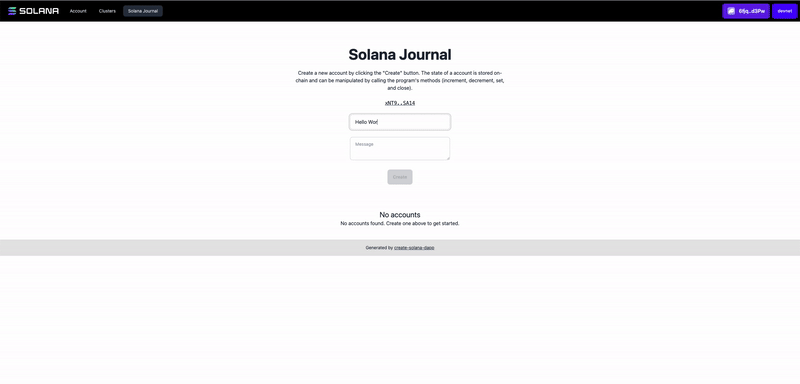

# Solana Journal

This project is an introduction to create Solana Dapps using [create-solana-dapp](https://github.com/solana-developers/create-solana-dapp).



## Links
* [Developer Notes](./NOTES.md)
* Devnet Program: [xNT9fpMyDBXvCMAkTafwWdQHkjrAR3gCdXjtubMSA14](https://explorer.solana.com/address/xNT9fpMyDBXvCMAkTafwWdQHkjrAR3gCdXjtubMSA14?cluster=devnet)

## Source
* [How to Build a CRUD dApp on Solana](https://solana.com/developers/guides/dapps/journal)

### Prerequisites

- Node v18.18.0 or higher
- Rust v1.70.0 or higher
- Anchor CLI 0.29.0 (not 0.30.0) - see issues with anchor 0.30 IDL in [Notes](./NOTES.md)
- Solana CLI 1.18.0 or higher

### Setup
* [Installing Rust on Mac OS X](https://www.petergirnus.com/blog/rust-macos-how-to-install)
    * For 
* [Installing Anchor with AVM](https://www.anchor-lang.com/docs/installation)

### Installation

#### Clone the repo

```shell
git clone solana-journal
cd solana-journal
```

#### Install Dependencies

```shell
npm install
```

#### Start the web app

```
npm run dev
```

## Apps

### anchor

This is a Solana program written in Rust using the Anchor framework.

#### Commands

You can use any normal anchor commands. Either move to the `anchor` directory and run the `anchor` command or prefix the command with `npm run`, eg: `npm run anchor`.

#### Sync the program id:

Running this command will create a new keypair in the `anchor/target/deploy` directory and save the address to the Anchor config file and update the `declare_id!` macro in the `./src/lib.rs` file of the program.

You will manually need to update the constant in `anchor/lib/counter-exports.ts` to match the new program id.

```shell
npm run anchor keys sync
```

#### Build the program:

```shell
npm run anchor-build
```

#### Start the test validator with the program deployed:

```shell
npm run anchor-localnet
```

#### Run the tests

```shell
npm run anchor-test
```

#### Deploy to Devnet

```shell
npm run anchor deploy --provider.cluster devnet
```

### web

This is a React app that uses the Anchor generated client to interact with the Solana program.

#### Commands

Start the web app

```shell
npm run dev
```

Build the web app

```shell
npm run build
```
